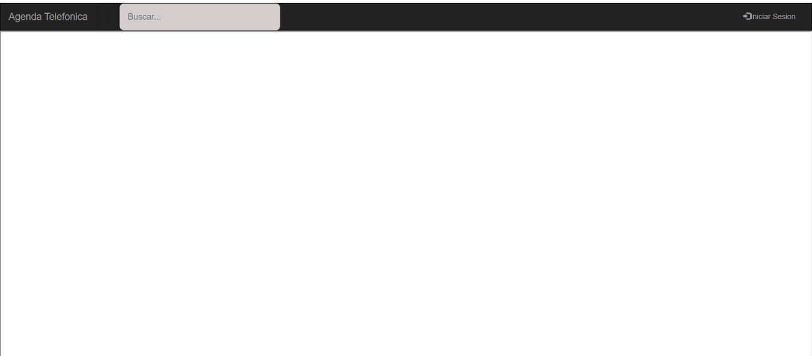
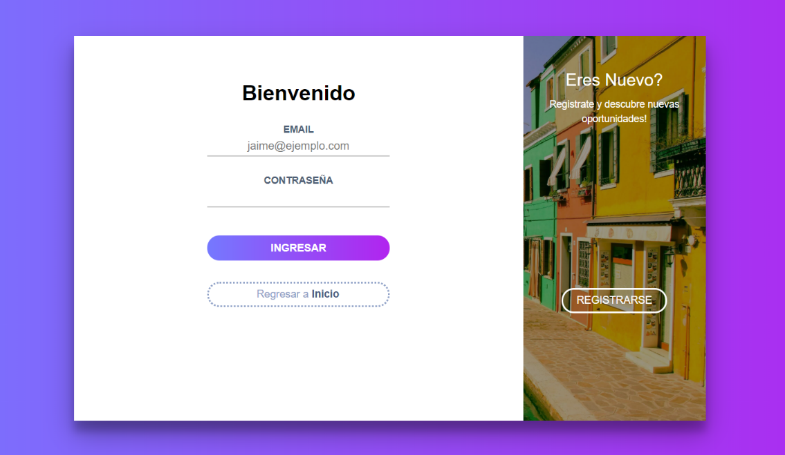

# Practica-de-laboratorio-02--Servlets--JSP-y-JPA
 
## ACTIVIDADES DESARROLLADAS
#### 1. Desarrollar una aplicación con tecnología JEE para gestionar una agenda telefónica en la web.
#### 2. Implementar el README del repositorio del proyecto con la misma información del informe de la práctica
#### 3. Crear un repositorio en GitHub con el nombre “Practica00 – Consumo de APIs en la nube”
#### 5. Realizar varios commits en la herramienta GitHub que demuestren el desarrollo de la aplicación.

### 1)	Pagina principal 

### 1)	Los usuarios pueden registrarse en la aplicación a través de un formulario de creación de cuentas.

### 2)	Un usuario puede iniciar sesión usando su correo y contraseña

### 3)	Una vez iniciado sesión el usuario podrá: o Registrar, modificar, eliminar, buscar y listar sus teléfonos.
##### •	El usuario puede registrar su nuevo teléfono

##### •	El usuario puede buscar un número de teléfono en especifico

##### •	El usuario podrá modificar o eliminar sus números de telefonos

### 4)	Listar los números de teléfono de un usuario usando su número de cédula o correo electrónico

##### •	Muestra el usuario por su numero de cedula o correo

##### •	Lista todos los teléfonos del usuario encontrado

## CONCLUSIONES:
En esta practica se obtuvo mejores resultados al momento de realizar consultas, de una forma más simple y sin ocupar lineas de codigo muy extensas, se pudo lograr trabajar de forma más enfocada a java, y con la implementacion del diseño DAO se pudo reforzar el entendimiento a este diseño.
